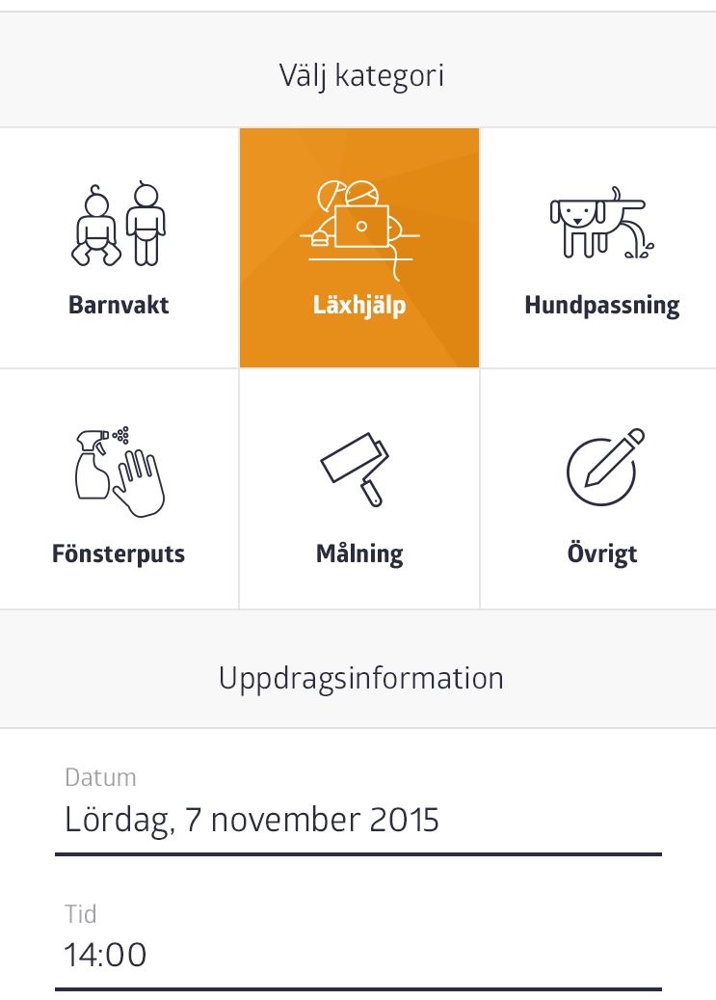

# Welcome to the yepstr code assignment

This code assignment is here not just for us, but for you to try out a new technology.
The project is set up more or less as our main yepstr project. Don't just see
this as a code assignment, but also a great possibility to play and learn `React`.

## Getting it to run
First make sure you have node, preferably version `0.10.32`.
To install everything that is needed just run `npm install`.
When everything is installed, run `npm run watch` to start a
small server which will serve the code assignment app. In your favorite browser,
navigate to `http://localhost:3003` and you will see the app.
Currently, it doesn't do much but it has the basics that is needed for further development.

## A small introduction
The app is written in ES6 which is transpiled to ES5 with babel. In the `src`
folder the source code for the app can be found. The first file to take a closer
look at is `routes.js`. That file sets up the different routes we can visit
in the app. Because this is only a small assignment only one route is defined.
That route will show the page that is defined in the file at `src/pages/newTask.js`.

## The assignment
As part of booking a new task a category, date and time has to be selected.
For this assignment, we want you to implement that part of the new task form.
When the page is first loaded, no category, date or time has been selected.
But all the different categories are shown. When you click on a category, it is
selected and a orange background is applied to indicate that it has been selected.
A screen of the whole form is shown below. Create new files, reorganize, remove,
add or delete everything we have done and start for scratch! Just do whatever
to do the assignment and  put as much effort into this as you see reasonable and have fun!

### Assets
The data needed for all the categories are provided in the file `data/Category.json` and
the icons for the categories can be found in the folder `public/img/`.

Good Luck and please contact us if you have any questions or problems!
gustav@yepstr.com and filip@yepstr.com
